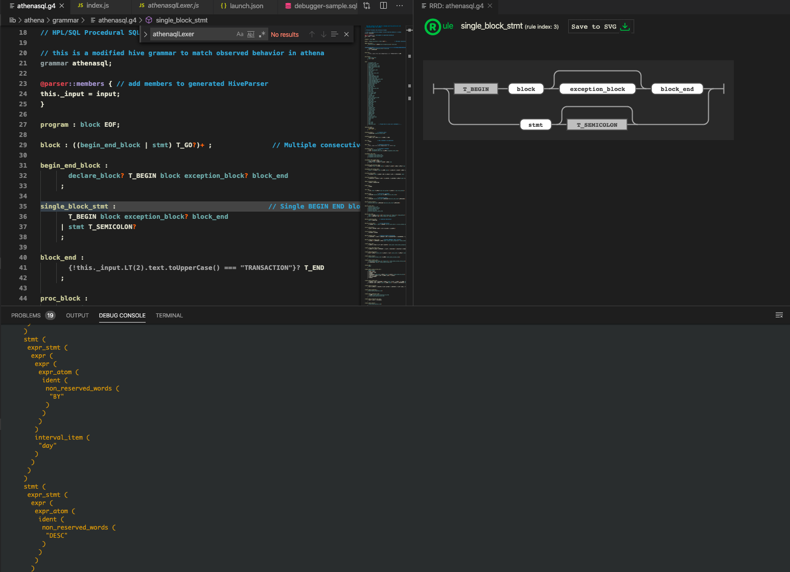

## Releasing new versions

wharfie defines a seperate package.json file for its npm installable client library(`./client/package.json`) this should be kept inline with the top level package.json version. the reason this package exists is to prevent non-client deps from being included in the published npm package.

### Releasing a new version of the service

```bash
## with a clean git working directory
npm version <patch|minor|major>
git push origin master --follow-tags
wharfie deploy update deployment
```

### Releasing a new version of the `@wharfie/wharfie` cf helper library

```bash
## with a clean git working directory
cd ./client/
npm --no-git-tag-version version <patch|minor|major>
git push origin master
npm publish
```

## Developing with Antlr4

#### What is Anlr4?

https://github.com/antlr/antlr4

Antlr4 is a parser generator. A parser is a program that accepts text as an input and can organize that text into a data structure called an Abstract Syntax Tree (AST). AST's are one of the main building blocks for computing and act as a core abstraction between user written code and machine executable operations.

#### How is it used?

Wharfie includes a grammar for athena SQL that Antlr uses to parse all queries, to extract information about what databases and tables are used in a given query.

#### How can I develop this grammar?

1. use vs-code
2. install antlr `brew install antlr`
3. install the [antlr4 extension](https://github.com/mike-lischke/vscode-antlr4)
4. open and run the debbuger, the debugger is configured in `.vscode/launch.json`



#### Publishing a new grammar

1. `npm run grammar:generate`
2. convert the generated code from being ES6 modules into commonJS

## Developing with Firecracker

Wharfie uses microVMs and unikernals to provide secure and fast lambda compute. Firecracker is used for microVMs and nanos for unikernals. For local development and testing Vangrant manages all creation of VMs.

### Installing vagrant on macos

1. install rosetta `/usr/sbin/softwareupdate --install-rosetta --agree-to-license`
2. install VMWare Fusion 13
3. install vagrant `brew install vagrant`
4. install vmware vagrant utility `brew install --cask vagrant-vmware-utility`
5. install vmware vagrant plugin `vagrant plugin install vagrant-vmware-desktop`
6. `vangrant up` to verify install is working properly

### Installing ops/nanos on macos

1. install qemu `brew install qemu`
2. install ops/nanos `curl https://ops.city/get.sh -sSfL | sh`
